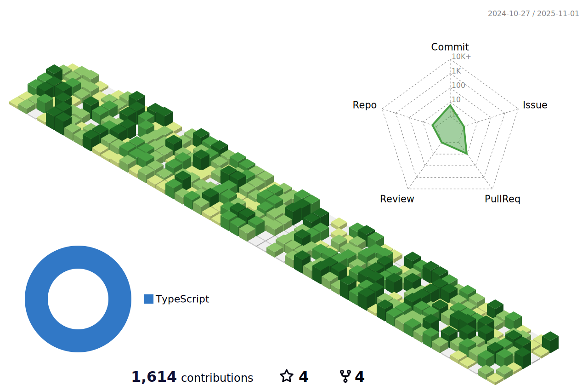

# Hi there 

#### I'm a Full Stack Developer working in Zurich, Switzerland.

<div class="inline-block">
  
  
  
  
  
  
  
</div>


<br/><br/>

#### A little more about me...

```python
#!/usr/bin/python
# -*- coding: utf-8 -*-


class SoftwareEngineer:

    def __init__(self):
        self.name = "Marco Romanutti"
        self.role = "Software Engineer"
        self.language = ["de_CH", "en_US"]

    def say_hi(self):
        print("Thanks for dropping by, hope you find some of my work interesting.")


me = SoftwareEngineer()
me.say_hi()

```

#### You can reach me at [dev.to/romanutti](https://dev.to/romanutti)

<br/><br/>
<br/><br/>

---
<div class="inline-block">
  
  
</div>

